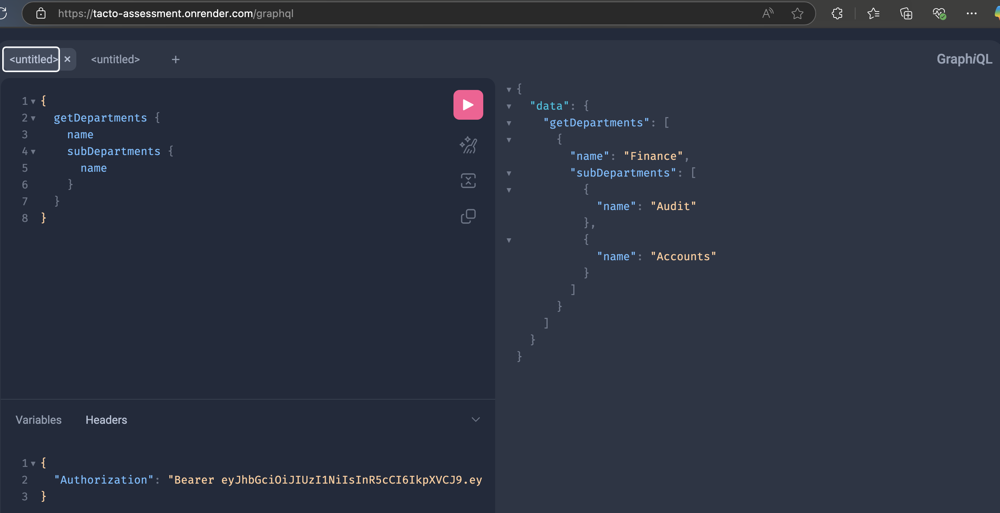
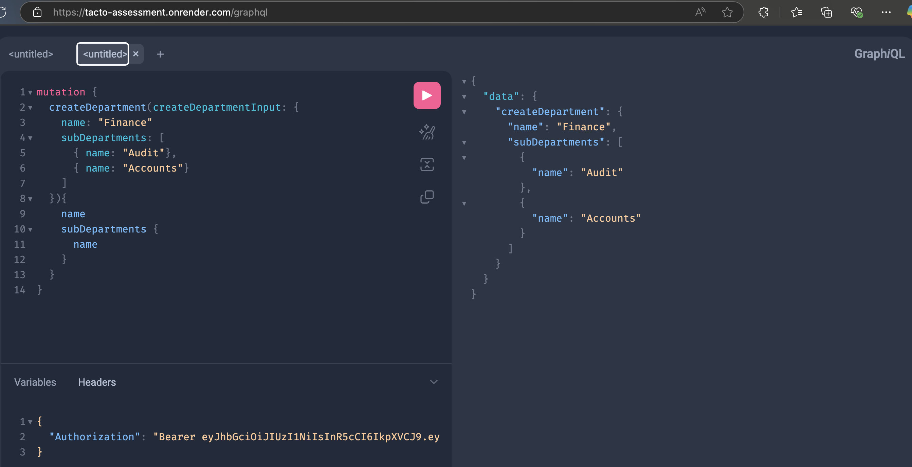
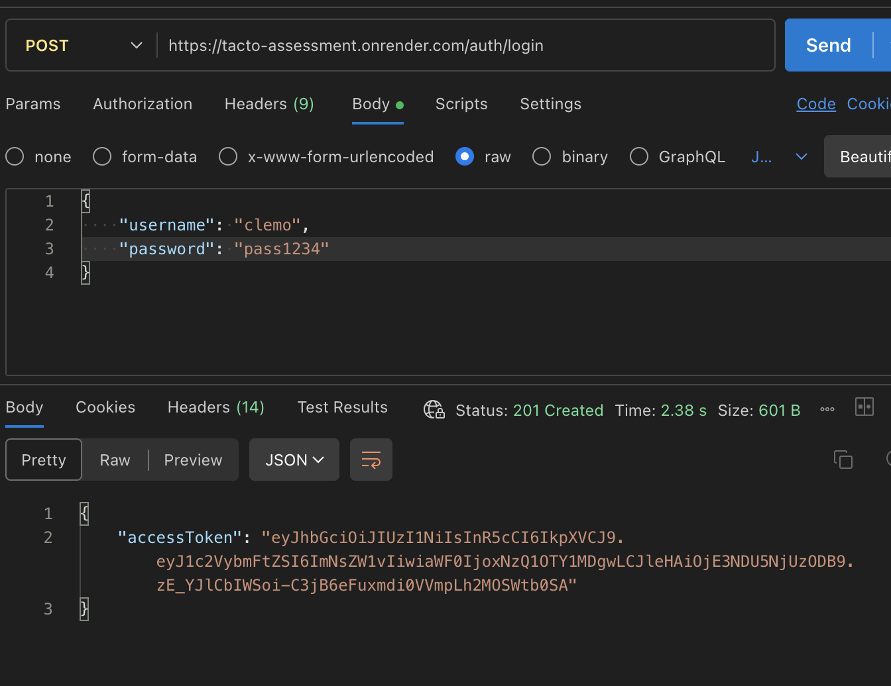

<p align="center">
  <a href="http://nestjs.com/" target="blank"></a>
</p>


<h1 style="text-align: center;" > Assessment</h1>


## Prerequisites
1. Have NodeJs(LTS) installed on your system
2. Have nest framework installed globally using `pnpm`
3. Make sure docker is installed on your system


## Project setup
1. Clone the repo on your system
2. Install packages using `$ pnpm install`
3. Create `.env` at root folder and use the format in `.env.example`
4. Make sure your docker is running, then start postgres db server by running the `docker-compose.yml` file : `$ docker-compose up`
5. <b><u> Uncomment the commented code in database.module and comment out the url line:</u><b>


## Run the project

```bash
# watch mode
$ npm run start:dev

```

## Endpoints
1. Create user  
```graphql
mutation {
  createUser(createAuthInput: { username: "clemo", password: "pass1234"}) {
    username
  }
}
```
2. Login `localhost:PORT/auth/login`

## Examples

<p align="center">
  <a href="http://nestjs.com/" target="blank"></a>
</p>

<p align="center">
  <a href="http://nestjs.com/" target="blank"></a>
</p>

<p align="center">
  <a href="http://nestjs.com/" target="blank"></a>
</p>

## Deployment Link:
`https://tacto-assessment.onrender.com`

### Introspection has been enabled for futther testing
`https://tacto-assessment.onrender.com/graphql`
